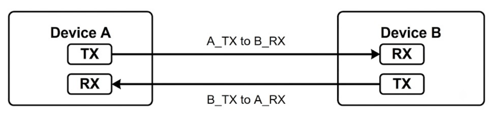
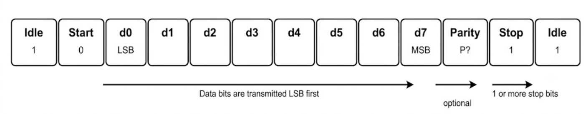

This project showcases the design and verification of - 

- an UART Clk Generator that can produce variable transmitter clk and receiver clk signals according to variable baud rate.
- an UART Controller which will be consisting of an UART transmitter, UART receiver and the clk generator.

The verification of the UART Controller has been performed by an UVM-based testbench architecture using Siemens Questa Sim 10.7 Simulator.

--------------------------------------------------------------------

# Protocol Overview and Charateristics

- UART stands for Universal Asynchronous Receiver and Transmitter. It is a hardware communication protocol that allows two digital devices (such as microcontrollers, sensors, or computers) to exchange data serially, bit-by-bit. 
- Communication occurs over just two wires: one for transmitting (TX) and one for receiving (RX). It is considered **asynchronous** because the transmitter and receiver do not share a common clock signal.
- They rely on a pre-agreed transmission speed (Baud Rate) to decode the data.
  
--------------------------------------------------------------------

# UART Connections 

A basic full-duplex UART connection is simple: each device’s TX pin connects to the other device’s RX pin.

  
--------------------------------------------------------------------

# Data Framing Structure

- Data framing defines how a single data byte is structured for transmission. This ensures that the receiving device can correctly identify where a data packet begins and ends.

- When the line is idle (no data is being sent), it is held at a logic-high state. The framing process converts parallel data from the CPU into a serial frame, which typically consists of:

| Bit type | Description |
| :--- | :--- |
| **Start Bit** | The transmission begins with a transition from high to low (logic 0), signaling the start of the data frame. |
| **Data Bits** | This is the actual payload, commonly 8 bits long (though it can range from 5 to 9 bits). These bits are transmitted Least Significant Bit (LSB) first. |
| **Parity Bit (Optional)** | A bit used for error detection. It can be configured as "even" or "odd" to ensure the total number of '1's in the frame matches the selected parity, or it can be set to "none". |
| **Stop Bit(s)** | The frame ends with 1 or 2 bits held at logic-high (1), signaling the end of the byte and giving the receiver time to prepare for the next frame. |

- Once received, the receiving UART strips away these **framing bits** and converts the data back into a parallel format for the internal data bus.

--------------------------------------------------------------------

# Baud Rate, Oversampling and Throughput

- As there is no shared clock line, both communicating devices must agree to operate at the exact same **Baud Rate, which is the number of *bits* transmitted per second.**
- This is not the same as **Throughput** which is the amount of data processed **(useful data)** or operations completed by a digital circuit per unit of time.
- For example, at a 9600 baud rate, each individual bit duration is precisely 104.16 µs (1/9600).
- In a standard 8-N-1 configuration (1 Start, 8 Data, No Parity, 1 Stop), transmitting a single byte requires 10 bit periods. Therefore, at 9600 baud, the **maximum data throughput** or **byte rate** is roughly 960 bytes per second.

## Receiver Oversampling: 

To read this incoming data accurately, the receiver uses a technique called oversampling. The receiver's clock is generated to run much faster than the incoming data—typically 16 times the baud rate. This allows the receiver to sample the incoming signal multiple times per bit duration, effectively pinpointing the precise middle of each bit pulse to avoid reading errors during edge transitions.

--------------------------------------------------------------------

